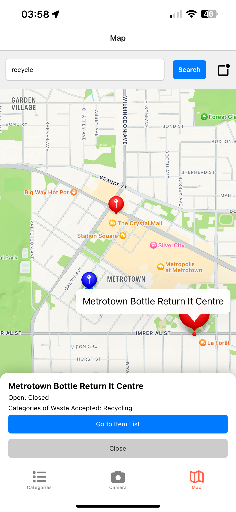
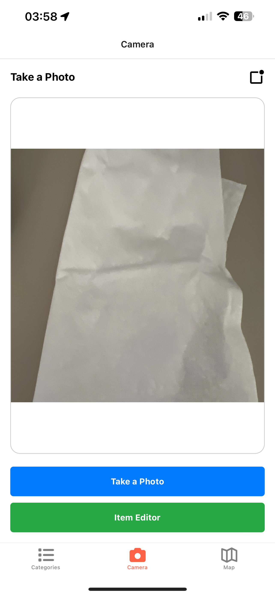
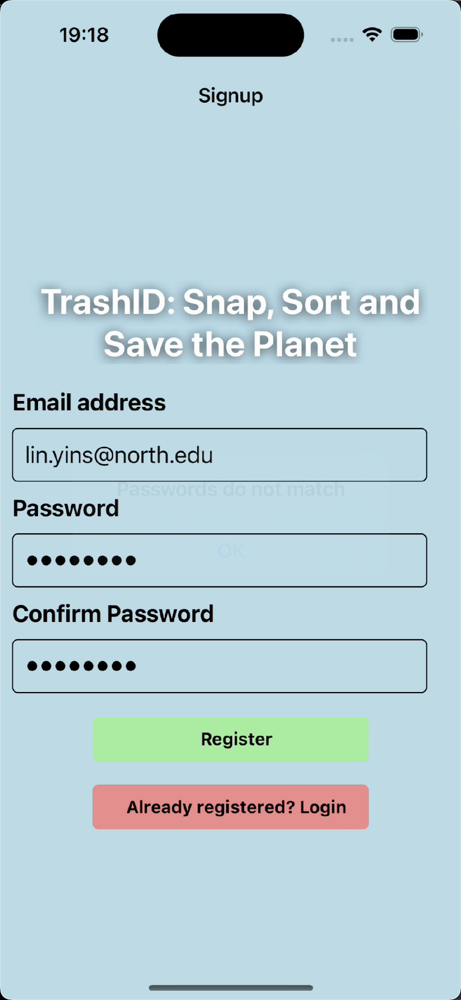
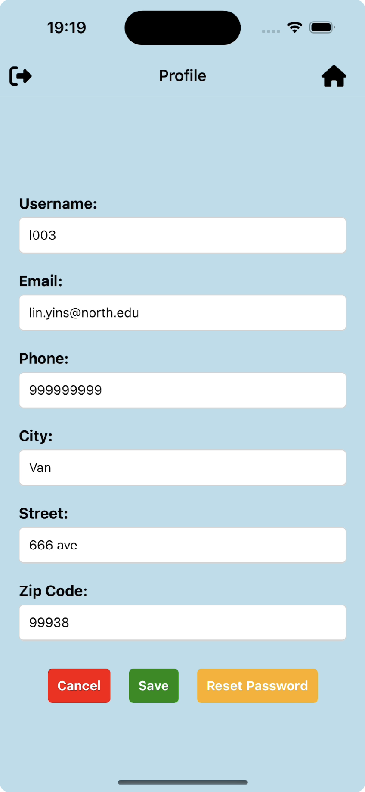
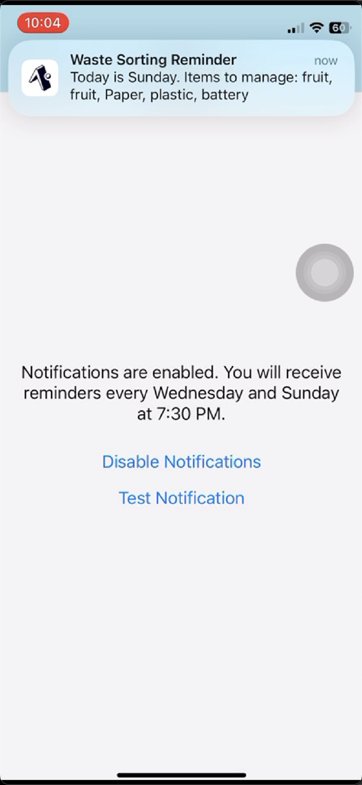

# Trash-ID - Smart Waste Management App

## Project Overview
TrashID is a smart waste management app that helps users take control of their trash through AI- powered image analysis. Simply snap a photo of any waste item, and the app will instantly identify and categorize it into Garbage, Recyclables, or Organic Waste.

## App Functionality
- **AI-Powered Trash Identification:** 
Take a photo of your waste, and the app will automatically classify it into the correct category.  

- **Category Management:** 
Track your waste collection across categories like Food, Recycling, Hazardous and Organic.  

- **Personalized Disposal Plans:** 
Set reminders for when and where to dispose of your trash effectively.  

- **Map Integration:** 
Interactive maps help you find nearby recycling centers and appropriate waste disposal locations.  

- **Garbage Collection Schedule:** 
Get updated garbage truck schedules based on your location, so you never miss a pickup.  

- **CRUD Operations:** 
Easily create, view, update, or delete information related to your waste management.  

## Data Model and Firebase Collections

### Firestore Collections

#### Collection 1: trash data:
- Collection name: trashData  
- Document ID: userInfo( will be added in authentication component) 
    - **Fields:** 
    - username(string): Username of the user, 
    - email(string): Email address of the user, 
    - phone(string): Phone number, 
    - id(string): Unique identifier for the user, 
    - address: 
        - city(string): City of the user, 
        - street(string): Street address, 
        - zip(string): Zip code, 
    - geo: 
        - lat(string): Latitude, 
        - long(string): Longitude, 
    - **sub-collection: trash** 
    -  **Fields:** 
    - Document ID: Auto-generated
      - trashID(string): Unique identifier for the trash item, 
      - trashType(string): Type of trash (e.g., Tetra, Plastic, Glass), 
      - trashDate(string): Date when the trash was recorded 
      - source(string): URI of the image related to the item 

- **CRUD Operations (in collection 1: trashData):** 
    - Create: Post new waste item 
    - Read: View item info 
    - Update: Edit item info 
    - Delete: Delete item 

#### Collection 2: Trash Key Words: used to categorize trash items
- Collection name: trashKey  
- Document ID: Auto-generated
- **Fields:**
- category(object) 
    - organic(array): Type of organic trash keywords, 
    - recyclable(array): Type of recyclable trash keywords, 
    - hazardous(array): Type of hazardous trash keywords, 
    - justGarbage(array): Type of general garbage keywords, 
- **NO CRUD Operations in collection 2**

#### Collection 3: Recycle Center locations (will be built using API):
- Document ID: Auto-generated
- **Fields:**
- recycleLocation(array) 
    - center 1(object): 
        - name(string): Name of the recycling center, 
        - openHour(string): opening and closing time, 
        - geo(object): 
            - lat(string): Latitude, 
            - long(string): Longitude, 
- **NO CRUD Operations in collection 2**

#### Collection 4 Schedule of garbage collection trucks:(optional: depending on the availability of the API)
- Document ID: Auto-generated
- **Fields:**
- collectionSchedule(object) 
    - area 1(object): 
        - day(string): Day of the week, 
        - time(string): Time of collection, 
        - range(string): Area of collection, 
    - area 2(object): 
        - day(string): Day of the week, 
        - time(string): Time of collection, 
        - range(string): Area of collection, 
    - area 3(object): 
        - day(string): Day of the week, 
        - time(string): Time of collection, 
        - range(string): Area of collection, 
    - area 4(object): 
        - day(string): Day of the week, 
        - time(string): Time of collection, 
        - range(string): Area of collection, 

## Contributions

### Team Members:

- Hao Pei
- Yin-Shan Lin

### Contributions Summary:

**Hao Pei:** 
*Iteration 1:* 
Implemented authentication and connection flow with Firebase Firestore, including CRUD operations with the database. Developed item editor, item list, item info, and categories screens with full functionality. 
*Iteration 2:* 
Utilized Firebase authentication with email and password to ensure secure access to protected resources. Designed a login screen with features like password strength validation and account recovery options. Anonymous users does not have access to the data or use of APP, while account and profile details are available to logged-in users. Implemented the profile screen to enable users to view and edit their account information. Users can also log out of the app securely and reset their password if needed. 
*Iteration 3:* 

**Yin-Shan Lin:** 
*Iteration 1:* 
Set up the initial project structure and navigation using React Navigation. Completed CRUD operations in the application. Developed and styled the camera screen, item editor screen, item list screen, item info screen, and categories screen, including functionality implementation. 
*Iteration 2:* 
Successfully implemented and handled camera permissions and usage, as well as location permissions and interactive map functionality with features such as displaying the user's current location, searching for places, and navigating through map markers. 
*Iteration 3:* 
Integrated the Google Vision API to identify item categories based on images, ensuring accurate classification. Implemented local notifications, allowing users to schedule meaningful reminders related to waste management functionality. Resolved bugs in the Search Item feature. 

## Screenshots
Categories

Item List

Edit Item

Map

Camera

Signin

Profile

Notif

## Version Control and Collaboration
All team members have cloned the repository, created their own branches for features, and merged their changes into the main branch after review. Regular commits and pulls ensure that everyone has the latest updates.

### Note on Contributions
If there are any contributions not directly reflected in GitHub commits (e.g., planning and design discussions), they are noted here along with the responsible team members.

## Demo Video
[Demo 7 minutes](https://www.youtube.com/watch?v=HSr4WFZ8oRA)
 
[Demo 5 mintues](https://youtu.be/-1CpOphaBr8)
 

